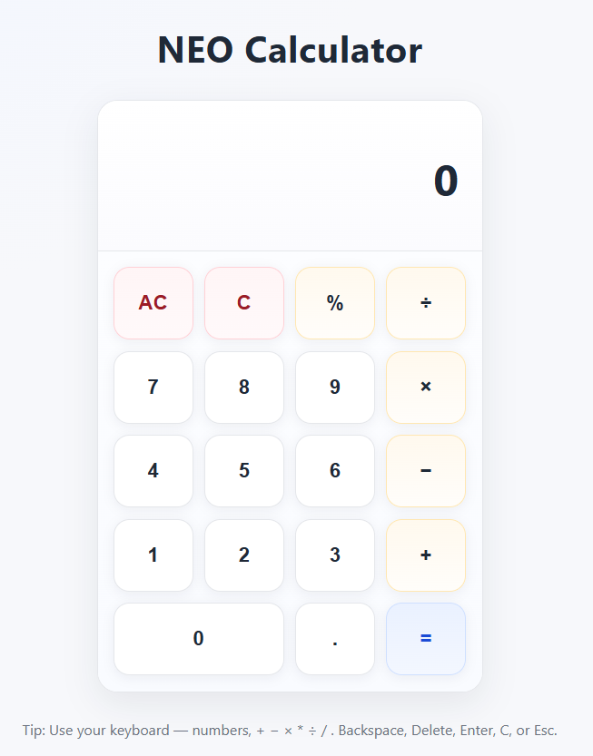

# NEO Calculator

A clean and responsive calculator application built using **HTML**, **CSS**, and **Vanilla JavaScript**. It provides accurate calculations, real-time evaluation, and a minimal user interface suitable for desktop and web use.

---

## Preview



---

## Features

* **Keyboard and Mouse Input** — Fully supports both input methods
* **Real-time Evaluation** — Displays live calculation results as you type
* **Supported Operations** — Addition, subtraction, multiplication, division, percentages, and decimals
* **Accessible Design** — Includes ARIA roles, focus indicators, and semantic HTML
* **Lightweight and Responsive** — Simple layout with no external dependencies

---

## Project Structure

```
neo-calculator/
├── index.html        # Main HTML structure
├── calculator.css    # Styles and layout
└── calculator.js     # Logic and interactivity
```

---

## Getting Started

1. Clone or download this repository.
2. Open `index.html` in any modern browser.
3. Use the calculator with your mouse or keyboard.

**Keyboard Shortcuts:**

* Numbers: `0–9`
* Operators: `+ - × * ÷ / %`
* Decimal: `.`
* Backspace (`C`), Delete/Escape (`AC`), Enter (`=`)

---

## Accessibility

* Uses `role="application"` and ARIA labels for assistive technologies.
* Provides focus outlines and clear button states.
* Announces current input and live results.

---

## License

Copyright © 2025 Dhyan Patel — All rights reserved.

This project and its source code are the intellectual property of the author. No part of this project may be copied, modified, distributed, or used in any form without express written permission from the author.
